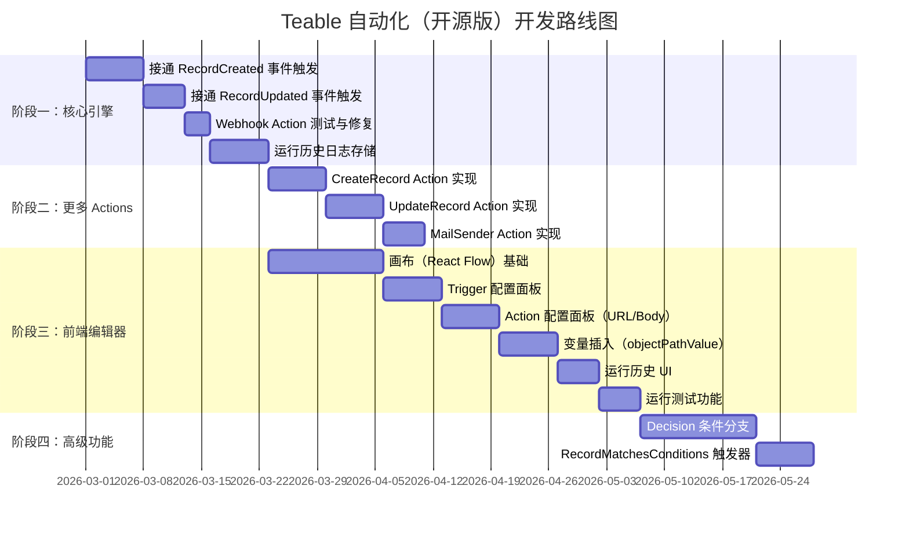

# Teable 自动化功能逆向分析 · 需求设计文档
> **文档说明**  
> 本文档由 Google Antigravity 结合浏览器代理（Playwright MCP）+ DevTools MCP 对 Teable 商业版实境操作，并辅以 Teable 开源仓库源码深度分析生成。  
> 覆盖范围：产品交互、API 负载（Payloads）、数据结构、执行引擎、数据库设计、开源版开发路线。
---
## 目录
1. [功能概述](#1-功能概述)  
2. [实境操作截图与 URL 结构](#2-实境操作截图与-url-结构)  
3. [前端画布 UI 规格](#3-前端画布-ui-规格)  
4. [核心 API 端点与负载 (Payloads)](#4-核心-api-端点与负载-payloads)  
5. [节点数据结构 · JSON Schema](#5-节点数据结构--json-schema)  
6. [执行引擎原理](#6-执行引擎原理)  
7. [数据库表结构设计](#7-数据库表结构设计)  
8. [开源版开发建议](#8-开源版开发建议)  
9. [开发路线图](#9-开发路线图)
---
## 1. 功能概述
Teable 自动化（Automation）是一套基于工作流的事件驱动自动化引擎，允许用户通过可视化配置"触发器 → 动作"节点，实现数据表变更与外部系统联动。
### 1.1 核心概念
| 概念 | 英文 Key | 说明 |
|---|---|---|
| **自动化流程** | `Workflow` | 一组由触发器、动作节点组成的自动化规则 |
| **触发器** | `Trigger` | 监听特定事件（如记录创建）以启动流程 |
| **动作** | `Action` | 被触发后执行的操作（如 Webhook、邮件、CRUD） |
| **条件分支** | `Decision` | 对后续 Action 节点进行条件判断（商业版） |
| **节点链** | `Node Chain` | Action 以链式结构（linkedList）存储执行顺序 |
### 1.2 已识别的节点类型
#### Trigger 类型（`TriggerTypeEnums`）
```typescript
enum TriggerTypeEnums {
  RecordCreated            = 'RECORD_CREATED',
  RecordUpdated            = 'RECORD_UPDATED',
  RecordMatchesConditions  = 'RECORD_MATCHES_CONDITIONS',
}
```
#### Action 类型（`ActionTypeEnums`）
```typescript
enum ActionTypeEnums {
  Webhook      = 'webhook',
  MailSender   = 'mail_sender',
  CreateRecord = 'create_record',
  UpdateRecord = 'update_record',
  Decision     = 'decision',   // 条件分支，商业版功能
}
```
> **注意**：商业版 UI 中，`webhook` 动作被命名为 **"HTTP 请求"**，这是展示层的重命名，后端 `actionType` 字段值仍为 `webhook`。
---
## 2. 实境操作截图与 URL 结构
### 2.1 URL 路径结构
通过浏览器操作实录，提取到以下 URL 模式：
```
# 自动化列表（Base 级别，所有自动化）
https://app.teable.io/base/{baseId}
# 自动化编辑器
https://app.teable.io/base/{baseId}/automation/{workflowId}
```
**实录环境 ID 信息：**
| 资源 | ID |
|---|---|
| Space ID | `spcMdgrZm9vcz4DtTQe` |
| Base ID | `bsekcJ6YKUqaLgnIISu` |
| Table ID | `tblFuZgNOtQbi5xjqgC` |
| Workflow ID | `wflwH7750tFksJZnyax` |
| Trigger ID | `cmm4he1541h0zoa2qseem9wb7` |
| Action ID | `cmm4hfr1o1bx6rb2px1ll7t20` |
### 2.2 自动化编辑器界面结构
实录截图展示的画布结构如下：
```
┌─────────────────────────────────────────────────────────┐
│  [开关] 新自动化          [运行测试]  [运行历史]  [?] [⋯]│
├─────────────────────────────────────────────────────────┤
│                                                         │
│                 ┌──────────────────────┐               │
│                 │ + 1. 当记录创建时     │ [触发器]      │
│                 │ 当在 表格 表格中新建... │               │
│                 └──────────┬───────────┘               │
│                            │ (+)                        │
│                            ▼                            │
│                 ┌──────────────────────┐               │
│                 │ 🌐 2. HTTP 请求       │ [执行操作]     │
│                 └──────────┬───────────┘               │
│                            │ (+)                        │
│                            ▼                            │
│                           (−) ← 结束节点               │
└─────────────────────────────────────────────────────────┘
```
**侧边栏（属性面板）结构：**
当点击节点时，右侧展开属性面板，包含：
- **触发器面板**：选择触发表格、添加过滤条件（Filters）
- **动作面板**：选择 Action 类型、配置 URL / Method / Headers / Body / 响应参数
- **运行历史面板**：展示执行记录列表（成功/失败状态、时间戳、节点快照）
---
## 3. 前端画布 UI 规格
### 3.1 技术栈
商业版前端使用 **React Flow** 渲染画布，节点以 `react-flow__node` 类名呈现，支持拖拽重排和增减节点。
### 3.2 画布组件层级
```
<AutomationCanvas>
  ├── <ReactFlow>
  │     ├── <TriggerNode>           ← 触发器节点（唯一）
  │     ├── <ActionNode>            ← 动作节点（可多个，链式）
  │     │     ├── <NodeTypeSelector>   → 选择 actionType
  │     │     ├── <NodeDescription>   → 描述输入
  │     │     └── <NodeConfigPanel>   → 具体配置（URL/Method等）
  │     └── <EndNode>              ← 结束节点（⊖ 图标）
  ├── <TopBar>
  │     ├── <Toggle isActive />     → 启用/停用 workflow
  │     ├── <WorkflowName />
  │     ├── <RunTestButton />       → 手动运行测试
  │     └── <RunHistoryButton />    → 查看运行历史
  └── <RunHistoryPanel>            ← 右侧抽屉，展示执行日志
```
### 3.3 节点之间的添加逻辑
画布中，节点间的 `+` 按钮允许：
- 在当前节点**之后**插入新 Action（`parentNodeId` 有值，`nextNodeId` 为空）
- 在两节点**中间**插入（`parentNodeId` 和 `nextNodeId` 均有值）
---
## 4. 核心 API 端点与负载 (Payloads)
> **API 基础路径**：`https://app.teable.io/api`  
> **认证方式**：Bearer Token（Cookie Session 或 API Key）
### 4.1 Workflow（自动化流程）CRUD
#### 创建 Workflow
```
POST /api/base/{baseId}/workflow
```
**Request Body：**
```json
{
  "name": "新自动化"
}
```
**Response Body：**
```json
{
  "id": "wflwH7750tFksJZnyax",
  "name": "新自动化",
  "description": null,
  "deploymentStatus": "undeployed"
}
```
---
#### 获取 Workflow 详情
```
GET /api/base/{baseId}/workflow/{workflowId}
```
**Response Body（完整结构）：**
```json
{
  "id": "wflwH7750tFksJZnyax",
  "name": "新自动化",
  "description": null,
  "deploymentStatus": "active",
  "trigger": {
    "id": "cmm4he1541h0zoa2qseem9wb7",
    "triggerType": "RECORD_CREATED",
    "inputExpressions": {
      "tableId": {
        "type": "const",
        "value": "tblFuZgNOtQbi5xjqgC"
      }
    }
  },
  "actions": {
    "cmm4hfr1o1bx6rb2px1ll7t20": {
      "id": "cmm4hfr1o1bx6rb2px1ll7t20",
      "actionType": "webhook",
      "description": "HTTP 请求",
      "nextActionId": null,
      "inputExpressions": {
        "url": {
          "type": "template",
          "elements": [
            { "type": "const", "value": "https://webhook.site/test-teable-automation" }
          ]
        },
        "method": { "type": "const", "value": "POST" },
        "headers": null,
        "body": null,
        "timeout": { "type": "const", "value": 60000 },
        "responseParams": null
      }
    }
  }
}
```
---
#### 更新 Workflow 名称/配置
```
PATCH /api/base/{baseId}/workflow/{workflowId}
```
**Request Body：**
```json
{
  "name": "TestAutomation",
  "description": "新记录 → Webhook 通知"
}
```
---
#### 删除 Workflow
```
DELETE /api/base/{baseId}/workflow/{workflowId}
```
---
### 4.2 Trigger（触发器）API
#### 创建 Trigger
```
POST /api/base/{baseId}/workflow/{workflowId}/trigger
```
**Request Body：**
```json
{
  "workflowId": "wflwH7750tFksJZnyax",
  "triggerType": "RECORD_CREATED"
}
```
---
#### 更新 Trigger 配置（inputExpressions）
```
PUT /api/base/{baseId}/workflow/{workflowId}/trigger/{triggerId}
```
**Request Body（RecordCreated Trigger 绑定表格）：**
```json
{
  "inputExpressions": {
    "tableId": {
      "type": "const",
      "value": "tblFuZgNOtQbi5xjqgC"
    }
  }
}
```
**Request Body（RecordUpdated Trigger 带监听字段）：**
```json
{
  "inputExpressions": {
    "tableId": {
      "type": "const",
      "value": "tblFuZgNOtQbi5xjqgC"
    },
    "viewId": {
      "type": "const",
      "value": null
    },
    "watchFields": {
      "type": "array",
      "elements": [
        { "type": "const", "value": "fld3lttRR6796RFHG5L" }
      ]
    }
  }
}
```
---
#### 删除 Trigger
```
DELETE /api/base/{baseId}/workflow/{workflowId}/trigger/{triggerId}
```
---
### 4.3 Action（动作节点）API
#### 创建 Action
```
POST /api/base/{baseId}/workflow/{workflowId}/action
```
**Request Body：**
```json
{
  "workflowId": "wflwH7750tFksJZnyax",
  "actionType": "webhook",
  "parentNodeId": "cmm4he1541h0zoa2qseem9wb7",
  "nextNodeId": null
}
```
> `parentNodeId`：当前节点的上游节点 ID（触发器或上一个 Action）  
> `nextNodeId`：当前节点的下游节点 ID（下一个 Action，链表中间插入时使用）
---
#### 更新 Action 配置（inputExpressions）
```
PUT /api/base/{baseId}/workflow/{workflowId}/action/{actionId}
```
**Request Body（Webhook / HTTP 请求）：**
```json
{
  "description": "发送 Webhook 通知",
  "inputExpressions": {
    "url": {
      "type": "template",
      "elements": [
        { "type": "const", "value": "https://webhook.site/test-teable-automation" }
      ]
    },
    "method": {
      "type": "const",
      "value": "POST"
    },
    "headers": {
      "type": "object",
      "properties": [
        {
          "key":   { "type": "const", "value": "Content-Type" },
          "value": { "type": "const", "value": "application/json" }
        }
      ]
    },
    "body": {
      "type": "template",
      "elements": [
        { "type": "const", "value": "{\"recordId\": \"" },
        {
          "type": "objectPathValue",
          "object": { "nodeId": "trigger.cmm4he1541h0zoa2qseem9wb7", "nodeType": "trigger" },
          "path": { "type": "array", "elements": [ { "type": "const", "value": "id" } ] }
        },
        { "type": "const", "value": "\"}" }
      ]
    },
    "timeout": {
      "type": "const",
      "value": 60000
    },
    "responseParams": []
  }
}
```
> **关键细节**：`url` / `body` 字段使用 **`template`** 类型，支持嵌入动态变量（`objectPathValue`），指向上游节点的输出属性，这是 Teable 自动化变量插值系统的核心。
---
#### 移动 Action 位置
```
PATCH /api/base/{baseId}/workflow/{workflowId}/action/{actionId}/move
```
**Request Body：**
```json
{
  "parentNodeId": "triggerNodeId",
  "nextNodeId": null
}
```
---
#### 删除 Action
```
DELETE /api/base/{baseId}/workflow/{workflowId}/action/{actionId}
```
---
### 4.4 Workflow 运行 API
#### 手动运行测试
```
POST /api/base/{baseId}/workflow/{workflowId}/test/{nodeId}
```
> `nodeId` 为触发器节点 ID，前端传入选中的测试记录 ID。
**Request Body：**
```json
{
  "recordId": "rec_xxxxxx"
}
```
**Response Body（含各节点的输入输出快照）：**
```json
{
  "status": "success",
  "nodeResults": [
    {
      "nodeId": "cmm4he1541h0zoa2qseem9wb7",
      "nodeType": "trigger",
      "inputRaw": { "tableId": "tblFuZgNOtQbi5xjqgC" },
      "outputRaw": {
        "id": "rec_abc123",
        "name": "测试记录",
        "fields": {
          "fld3lttRR6796RFHG5L": "Hello Automation"
        }
      }
    },
    {
      "nodeId": "cmm4hfr1o1bx6rb2px1ll7t20",
      "nodeType": "action",
      "inputRaw": {
        "url": "https://webhook.site/test-teable-automation",
        "method": "POST",
        "body": "{\"recordId\": \"rec_abc123\"}"
      },
      "outputRaw": {
        "status": 200,
        "data": {}
      }
    }
  ]
}
```
---
#### 获取运行历史列表
```
GET /api/base/{baseId}/workflow/{workflowId}/run?skip=0&take=50
```
**Response Body：**
```json
{
  "total": 2,
  "items": [
    {
      "id": "run_xxxxxx",
      "workflowId": "wflwH7750tFksJZnyax",
      "status": "success",
      "startTime": "2026-02-27T05:30:00.000Z",
      "endTime": "2026-02-27T05:30:00.500Z",
      "nodeResults": [ /* 同上 */ ]
    }
  ]
}
```
---
#### 获取运行历史摘要（成功率统计）
```
GET /api/base/{baseId}/workflow/{workflowId}/run/summary
```
**Response Body：**
```json
{
  "total": 10,
  "successCount": 9,
  "failCount": 1,
  "successRate": 0.9
}
```
---
### 4.5 激活/停用 Workflow
```
PATCH /api/base/{baseId}/workflow/{workflowId}
```
**Request Body（启用）：**
```json
{
  "deploymentStatus": "active"
}
```
**Request Body（停用）：**
```json
{
  "deploymentStatus": "undeployed"
}
```
---
## 5. 节点数据结构 · JSON Schema
### 5.1 完整 Workflow VO 映射
```
AutomationWorkflow（数据库模型）
  ├── workflowId     : string   ← 主键
  ├── name           : string
  ├── description    : string?
  ├── deploymentStatus: 'active' | 'undeployed'
  ├── createdBy      : string
  └── lastModifiedBy : string
AutomationWorkflowTrigger（数据库模型）
  ├── triggerId      : string   ← 主键
  ├── workflowId     : string   ← 外键
  ├── triggerType    : TriggerTypeEnums
  ├── inputExpressions: JSON    ← 序列化 JSON 字符串
  ├── createdBy      : string
  └── lastModifiedBy : string
AutomationWorkflowAction（数据库模型）
  ├── actionId       : string   ← 主键
  ├── workflowId     : string   ← 外键
  ├── actionType     : ActionTypeEnums
  ├── description    : string?
  ├── parentNodeId   : string?  ← 上游节点 ID（链表前驱）
  ├── nextNodeId     : string?  ← 下游节点 ID（链表后继）
  ├── inputExpressions: JSON    ← 序列化 JSON 字符串
  ├── createdBy      : string
  └── lastModifiedBy : string
```
### 5.2 inputExpressions JSON Schema 类型系统
所有节点配置通过统一的 **JSON Schema Parser** 解析，支持以下6种原语类型：
| 类型 | `type` 值 | 用途 | 示例 |
|---|---|---|---|
| 空值 | `"null"` | 表示 null | `{"type":"null"}` |
| 常量 | `"const"` | 字符串/数字/布尔常量 | `{"type":"const","value":"POST"}` |
| 数组 | `"array"` | 多值列表（如字段 ID 列表）| `{"type":"array","elements":[...]}` |
| 对象 | `"object"` | 键值对对象（如 Headers）| `{"type":"object","properties":[{key,value},...]}` |
| 模板 | `"template"` | 混合静态文本+动态变量的字符串 | `{"type":"template","elements":[const,objectPathValue,...]}` |
| 对象路径值 | `"objectPathValue"` | 引用上游节点输出的某个路径 | `{"type":"objectPathValue","object":{nodeId,nodeType},"path":{...}}` |
### 5.3 Trigger InputExpressions 规格
#### RECORD_CREATED
```json
{
  "tableId": { "type": "const", "value": "tblXXXXXX" }
}
```
#### RECORD_UPDATED
```json
{
  "tableId": { "type": "const", "value": "tblXXXXXX" },
  "viewId":  { "type": "const", "value": null },
  "watchFields": {
    "type": "array",
    "elements": [
      { "type": "const", "value": "fldXXXXXX" }
    ]
  }
}
```
#### RECORD_MATCHES_CONDITIONS
```json
{
  "tableId": { "type": "const", "value": "tblXXXXXX" },
  "filter": {
    "conjunction": "and",
    "filterSet": [
      { "fieldId": "fldXXXXXX", "operator": "is", "value": null }
    ]
  }
}
```
### 5.4 Action InputExpressions 规格
#### webhook（HTTP 请求）
```json
{
  "url": {
    "type": "template",
    "elements": [
      { "type": "const", "value": "https://example.com/webhook" }
    ]
  },
  "method": { "type": "const", "value": "POST" },
  "headers": {
    "type": "object",
    "properties": [
      {
        "key":   { "type": "const", "value": "Authorization" },
        "value": {
          "type": "template",
          "elements": [
            { "type": "const", "value": "Bearer " },
            {
              "type": "objectPathValue",
              "object": { "nodeId": "action.xxx", "nodeType": "action" },
              "path": { "type": "array", "elements": [{ "type": "const", "value": "data.token" }] }
            }
          ]
        }
      }
    ]
  },
  "body": {
    "type": "template",
    "elements": [
      { "type": "const", "value": "{\"recordId\":\"" },
      {
        "type": "objectPathValue",
        "object": { "nodeId": "trigger.TRIGGER_ID", "nodeType": "trigger" },
        "path": { "type": "array", "elements": [{ "type": "const", "value": "id" }] }
      },
      { "type": "const", "value": "\"}" }
    ]
  },
  "timeout": { "type": "const", "value": 60000 },
  "responseParams": {
    "type": "object",
    "properties": [
      {
        "key":   { "type": "const", "value": "myVar" },
        "value": { "type": "const", "value": "data.result" }
      }
    ]
  }
}
```
#### create_record（创建记录）
```json
{
  "tableId": { "type": "const", "value": "tblXXXXXX" },
  "fields": {
    "type": "object",
    "properties": [
      {
        "key":   { "type": "const", "value": "fldXXXXXX" },
        "value": {
          "type": "template",
          "elements": [
            {
              "type": "objectPathValue",
              "object": { "nodeId": "trigger.TRIGGER_ID", "nodeType": "trigger" },
              "path": { "type": "array", "elements": [{ "type": "const", "value": "fields.fldXXXXXX" }] }
            }
          ]
        }
      }
    ]
  }
}
```
#### decision（条件分支）—— 默认 Schema
```json
{
  "groups": {
    "type": "array",
    "elements": [
      {
        "type": "object",
        "properties": [
          { "key": { "type": "const", "value": "hasCondition" }, "value": { "type": "const", "value": true } },
          { "key": { "type": "const", "value": "entryNodeId" },  "value": { "type": "null" } },
          {
            "key": { "type": "const", "value": "condition" },
            "value": {
              "type": "object",
              "properties": [
                { "key": { "type": "const", "value": "logical" }, "value": { "type": "const", "value": "and" } },
                {
                  "key": { "type": "const", "value": "conditions" },
                  "value": {
                    "type": "array",
                    "elements": [
                      {
                        "type": "object",
                        "properties": [
                          { "key": { "type": "const", "value": "dataType" },  "value": { "type": "const", "value": "text" } },
                          { "key": { "type": "const", "value": "valueType" }, "value": { "type": "const", "value": "text" } },
                          { "key": { "type": "const", "value": "left" },      "value": { "type": "null" } },
                          { "key": { "type": "const", "value": "operator" },  "value": { "type": "const", "value": "contains" } },
                          { "key": { "type": "const", "value": "right" },     "value": { "type": "null" } }
                        ]
                      }
                    ]
                  }
                }
              ]
            }
          }
        ]
      }
    ]
  }
}
```
---
## 6. 执行引擎原理
### 6.1 技术选型
Teable 自动化后端执行引擎基于 **[json-rules-engine](https://github.com/cachecontrol/json-rules-engine)** 实现，每个 Action 节点继承 `ActionCore`（即 `RuleProperties`），构成一条规则链。
### 6.2 执行流程
```
事件触发（RecordCreated / RecordUpdated）
       ↓
TriggerCore.listenerTrigger(event)
       ↓
WorkflowService.getWorkflowsByTrigger(tableId, [triggerType])
       ↓（对每个匹配的 workflow）
splitAction(workflow.actions)         ← 将 actions 链表拆分为：
  ├── actions: ActionCore[]          ← 顺序执行的普通动作列表
  └── decisionGroups: IDecision[]    ← 条件分支组
       ↓
callActionEngine(triggerFacts, actions, decisionGroups)
  ├── 初始化 facts：trigger.{triggerId} = { 记录数据 }
  ├── 为每个 Action 调用 ActionCore.bindParams()
  ├── 运行 json-rules-engine 规则引擎
  └── 每个 Action.onSuccess() 将输出写入：
      action.{actionId} = { data, status }  ← Almanac 事实
       ↓
后续 Action 通过 objectPathValue 引用：
  { "nodeId": "action.{id}", "nodeType": "action", path: "data.xxx" }
```
### 6.3 变量上下文（Almanac Facts）
| Fact Key 格式 | 来源 | 示例 |
|---|---|---|
| `trigger.{triggerId}` | 触发器（触发事件的记录数据） | `trigger.wtr_xxx → { id, fields }` |
| `action.{actionId}` | Action 执行输出 | `action.wac_xxx → { data: {...}, status: 200 }` |
> **路径解析规则**：以 `action.` 开头的 nodeId，在路径前自动拼 `data.`，即 `action.xxx[path]` → 实际取值 `data.{path}`
### 6.4 Action 链式执行顺序
Actions 通过 `parentNodeId` / `nextNodeId` 组成**单链表**，执行前由 `WorkflowActionService.getWorkflowActions()` 预排序：
```typescript
// 从链表头（parentNodeId 为空的节点）开始遍历
let currentObj = actionsData.find((obj) => isEmpty(obj.parentNodeId));
while (currentObj) {
  sortedActions.push(currentObj);
  currentObj = cacheById[currentObj.nextNodeId] || null;
}
```
---
## 7. 数据库表结构设计
### 7.1 `automation_workflow` 表
```sql
CREATE TABLE automation_workflow (
  workflow_id        VARCHAR(50)  PRIMARY KEY,
  name               VARCHAR(255) NOT NULL,
  description        TEXT,
  deployment_status  VARCHAR(20)  DEFAULT 'undeployed',  -- 'active' | 'undeployed'
  created_by         VARCHAR(100),
  last_modified_by   VARCHAR(100),
  created_at         TIMESTAMP    DEFAULT CURRENT_TIMESTAMP,
  updated_at         TIMESTAMP    DEFAULT CURRENT_TIMESTAMP
);
```
### 7.2 `automation_workflow_trigger` 表
```sql
CREATE TABLE automation_workflow_trigger (
  trigger_id          VARCHAR(50)  PRIMARY KEY,
  workflow_id         VARCHAR(50)  NOT NULL REFERENCES automation_workflow(workflow_id),
  trigger_type        VARCHAR(50)  NOT NULL,   -- 'RECORD_CREATED' | 'RECORD_UPDATED' | ...
  input_expressions   TEXT,                   -- JSON 序列化字符串
  created_by          VARCHAR(100),
  last_modified_by    VARCHAR(100),
  created_at          TIMESTAMP    DEFAULT CURRENT_TIMESTAMP,
  updated_at          TIMESTAMP    DEFAULT CURRENT_TIMESTAMP
);
-- 关键索引：根据 tableId 快速查找 workflow
-- JSON_EXTRACT(input_expressions, '$.tableId.value') = ?
CREATE INDEX idx_trigger_table_id ON automation_workflow_trigger((JSON_EXTRACT(input_expressions, '$.tableId.value')));
```
### 7.3 `automation_workflow_action` 表
```sql
CREATE TABLE automation_workflow_action (
  action_id          VARCHAR(50)  PRIMARY KEY,
  workflow_id        VARCHAR(50)  NOT NULL REFERENCES automation_workflow(workflow_id),
  action_type        VARCHAR(50)  NOT NULL,    -- 'webhook' | 'mail_sender' | ...
  description        TEXT,
  parent_node_id     VARCHAR(50),              -- 前驱节点 ID（触发器或上一个 Action）
  next_node_id       VARCHAR(50),              -- 后继节点 ID（下一个 Action）
  input_expressions  TEXT,                    -- JSON 序列化字符串
  created_by         VARCHAR(100),
  last_modified_by   VARCHAR(100),
  created_at         TIMESTAMP    DEFAULT CURRENT_TIMESTAMP,
  updated_at         TIMESTAMP    DEFAULT CURRENT_TIMESTAMP
);
```
### 7.4 `automation_workflow_run_log`（运行历史，需扩展实现）
```sql
CREATE TABLE automation_workflow_run_log (
  run_id         VARCHAR(50)  PRIMARY KEY,
  workflow_id    VARCHAR(50)  NOT NULL REFERENCES automation_workflow(workflow_id),
  status         VARCHAR(20)  NOT NULL,   -- 'success' | 'failed' | 'running'
  start_time     TIMESTAMP    NOT NULL,
  end_time       TIMESTAMP,
  node_results   TEXT,                   -- JSON 序列化各节点的 inputRaw/outputRaw
  error_message  TEXT,
  created_at     TIMESTAMP    DEFAULT CURRENT_TIMESTAMP
);
```
---
## 8. 开源版开发建议
### 8.1 当前开源版缺失功能
经代码分析，开源版（main 分支）已有以下基础：
| 功能 | 开源版状态 |
|---|---|
| Workflow CRUD API | ✅ 已实现 |
| Trigger 创建/更新 | ✅ 已实现 |
| Action 创建/更新/链式排序 | ✅ 已实现 |
| Webhook Action 执行 | ✅ 已实现 |
| RecordCreated 触发器 | ⚠️ 代码存在但事件监听被注释掉 |
| RecordUpdated 触发器 | ⚠️ 代码存在但事件监听被注释掉 |
| Decision（条件分支）| ⚠️ Schema 已定义，但执行逻辑不完整 |
| 邮件发送（mail_sender）| ⚠️ 已有框架，需配置 SMTP |
| 创建记录（create_record）| ⚠️ 枚举已定义，需实现具体动作 |
| 前端可视化编辑器 | ❌ 开源版无此 UI |
| 运行历史记录与查询 | ❌ 开源版无此功能 |
| 运行测试（Test Run）| ❌ 开源版无此功能 |
### 8.2 关键开发任务
#### 任务 1：接通事件触发器
开源版的 `TriggerRecordCreated.listenerTrigger()` 方法上有注释掉的 `@OnEvent(EventEnums.RecordCreated)` 装饰器。需要：
```typescript
// 1. 确认 EventEmitter 模块已正确引入
// 2. 恢复事件监听装饰器
@OnEvent(EventEnums.RecordCreated, { async: true })
async listenerTrigger(event: RecordCreatedEvent) {
  const { tableId, recordId } = event;
  // 3. 传入实际记录数据到 trigger facts（而非空对象 {}）
  const trigger = {
    [`trigger.${workflow.trigger.id}`]: {
      id: recordId,
      fields: await this.recordService.getRecordFields(tableId, recordId),
    },
  };
  this.callActionEngine(trigger, actions, decisionGroups);
}
```
#### 任务 2：实现运行历史日志
在 `callActionEngine()` 执行完成后，将结果持久化到 `automation_workflow_run_log` 表。
#### 任务 3：实现前端可视化编辑器
推荐基于 `@xyflow/react`（即 React Flow v12）开发画布，节点数据结构与 API 响应对应：
```
GET /workflow/{id} → nodes(trigger + actions) + edges → React Flow 渲染
拖拽/配置节点 → PUT /trigger/{id} 或 PUT /action/{id}
添加节点 → POST /action（带 parentNodeId/nextNodeId）
```
#### 任务 4：完善 `objectPathValue` 变量系统前端
需要在 Action 配置面板中，提供"插入变量"功能，将上游节点的 `outputVariables` 以下拉菜单形式展现，插入对应的 `objectPathValue` JSON schema。
### 8.3 推荐技术架构
```
前端：
  React + @xyflow/react（画布）
  ShadCN UI（属性面板）
  Zustand（状态管理）
  Tanstack Query（API 请求）
后端（现有）：
  NestJS + Prisma（ORM）
  json-rules-engine（执行引擎）
  node-fetch（Webhook 发送）
  
事件驱动：
  @nestjs/event-emitter (EventEmitter2)
  OR 替换为 BullMQ / Redis Pub/Sub（生产环境高可用）
数据库：
  PostgreSQL（Prisma 支持 JSON_EXTRACT 索引）
  建议使用 JSONB 类型替代 TEXT 存储 inputExpressions
```
---
## 9. 开发路线图

---
## 附录 A：Data Flow 全链路示意图
```
用户在表格中创建记录
        ↓
RecordCreatedEvent 发布（NestJS EventEmitter）
        ↓
TriggerRecordCreated.listenerTrigger()
        ↓
查询 automation_workflow_trigger 表
（JSON_EXTRACT 找到监听该表的所有 workflows）
        ↓
对每个 workflow：
  1. 读取 trigger.inputExpressions → 解析配置
  2. 读取 actions（链表排序）
  3. 初始化 Almanac Facts：
     { "trigger.{triggerId}": { id, fields } }
  4. 调用 json-rules-engine
  5. 按顺序执行每个 Action：
     - 解析 inputExpressions（含变量替换）
     - 执行 Action（如 fetch webhook）
     - 将 outputRaw 写入 Almanac: "action.{actionId}"
  6. 记录运行日志到 automation_workflow_run_log
```
---
**文档版本**：v1.0  
**生成时间**：2026-02-27  
**数据来源**：Teable 商业版（app.teable.io）实境操作 + Teable 开源版（github.com/teableio/teable main 分支）源码分析
