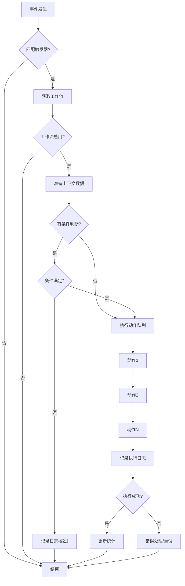
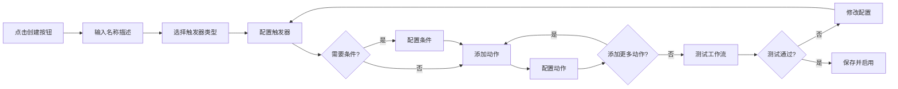

# Teable 自动化功能完善设计方案

> **文档版本**: v1.0  
> **创建日期**: 2026-02-05  
> **目标**: 基于 Teable 开源版完善自动化功能,对标 Monday.com 自动化能力

---

## 📋 目录

1. [项目背景](#1-项目背景)
2. [现状分析](#2-现状分析)
3. [功能对比](#3-功能对比)
4. [核心设计](#4-核心设计)
5. [技术架构](#5-技术架构)
6. [数据模型设计](#6-数据模型设计)
7. [API 设计](#7-api-设计)
8. [前端界面设计](#8-前端界面设计)
9. [实现计划](#9-实现计划)
10. [风险评估](#10-风险评估)

---

## 1. 项目背景

### 1.1 业务目标

基于 Teable 开源版实现类似 Monday.com 的项目管理平台,其中**自动化功能**是核心竞争力之一。需要构建一个强大、灵活、易用的自动化引擎。

### 1.2 用户价值

- **提升效率**: 自动化重复性任务,减少人工操作
- **降低错误**: 通过规则驱动,减少人为失误
- **增强协作**: 自动通知、分配任务,提升团队协作效率
- **灵活定制**: 支持自定义工作流,适应不同业务场景

---

## 2. 现状分析

### 2.1 Teable 现有实现

根据代码分析,Teable 当前状态:

#### ✅ 已有基础
- **基础框架**: 存在 `workflow` 概念和基础 API
  - 文件: `/packages/openapi/src/automation/workflow/create.ts`
  - 支持创建 workflow,包含 name、description、trigger 字段
- **企业版功能**: 自动化被标记为企业版功能
  - 文件: `/apps/nextjs-app/src/features/app/automation/Pages.tsx`
  - 当前显示"需要升级到企业版"的提示

#### ❌ 缺失功能
- **触发器系统**: trigger 字段为 `z.unknown()`,未定义具体类型
- **条件判断**: 无条件判断逻辑
- **动作执行**: 无动作执行引擎
- **可视化编辑器**: 无工作流可视化编辑界面
- **执行引擎**: 无自动化执行调度系统
- **执行历史**: 无执行日志和历史记录

### 2.2 Monday.com 自动化能力

根据官方文档 (https://monday.com/features/automations),Monday.com 提供:

#### 核心特性
1. **触发器 (Triggers)**
   - 记录创建/更新/删除
   - 字段值变更
   - 状态变更
   - 定时触发 (每天/每周/每月)
   - 到期日期触发

2. **条件 (Conditions)**
   - 字段值比较 (等于、不等于、包含、大于、小于等)
   - 多条件组合 (AND/OR)
   - 复杂逻辑判断

3. **动作 (Actions)**
   - 更新字段值
   - 创建新记录
   - 移动记录到其他组/板
   - 发送通知 (邮件、Slack、站内)
   - 分配任务
   - 创建子任务
   - 发送 HTTP 请求 (Webhook)
   - 集成第三方服务

4. **高级功能**
   - 可视化工作流编辑器 (拖拽式)
   - 模板库 (预设常用自动化)
   - AI 辅助生成自动化
   - 跨板自动化
   - 批量操作
   - 执行历史和日志

---

## 3. 功能对比

| 功能模块 | Monday.com | Teable 现状 | 优先级 | 说明 |
|---------|-----------|------------|--------|------|
| **触发器系统** | ✅ 完善 | ❌ 缺失 | P0 | 核心功能 |
| 记录创建触发 | ✅ | ❌ | P0 | 基础触发器 |
| 记录更新触发 | ✅ | ❌ | P0 | 基础触发器 |
| 字段变更触发 | ✅ | ❌ | P0 | 基础触发器 |
| 定时触发 | ✅ | ❌ | P1 | 定时任务 |
| **条件判断** | ✅ 完善 | ❌ 缺失 | P0 | 核心功能 |
| 字段值比较 | ✅ | ❌ | P0 | 基础条件 |
| 多条件组合 | ✅ | ❌ | P1 | 复杂逻辑 |
| **动作执行** | ✅ 完善 | ❌ 缺失 | P0 | 核心功能 |
| 更新字段 | ✅ | ❌ | P0 | 基础动作 |
| 创建记录 | ✅ | ❌ | P0 | 基础动作 |
| 发送通知 | ✅ | ❌ | P1 | 协作功能 |
| HTTP 请求 | ✅ | ❌ | P1 | 扩展性 |
| **界面** | ✅ 完善 | ❌ 缺失 | P0 | 用户体验 |
| 可视化编辑器 | ✅ | ❌ | P0 | 核心界面 |
| 执行历史 | ✅ | ❌ | P1 | 调试工具 |
| 模板库 | ✅ | ❌ | P2 | 易用性 |

**优先级说明**:
- **P0**: 核心功能,必须实现
- **P1**: 重要功能,第一阶段实现
- **P2**: 增强功能,后续迭代

---

## 4. 核心设计

### 4.1 设计原则

1. **模块化**: 触发器、条件、动作独立设计,易于扩展
2. **可扩展**: 插件化架构,支持自定义触发器和动作
3. **可靠性**: 异步执行,错误处理,重试机制
4. **可观测**: 完整的执行日志,便于调试和监控
5. **性能**: 高效的事件处理,避免阻塞主流程

### 4.2 核心概念

#### Workflow (工作流)
一个完整的自动化规则,包含:
- **基本信息**: 名称、描述、启用状态
- **触发器**: 定义何时触发
- **条件**: 定义是否执行 (可选)
- **动作**: 定义执行什么操作
- **配置**: 执行频率限制、错误处理策略等

#### Trigger (触发器)
定义工作流的启动条件:
```typescript
interface Trigger {
  type: TriggerType;           // 触发器类型
  config: TriggerConfig;       // 触发器配置
}

enum TriggerType {
  RECORD_CREATED = 'record_created',       // 记录创建
  RECORD_UPDATED = 'record_updated',       // 记录更新
  RECORD_DELETED = 'record_deleted',       // 记录删除
  FIELD_CHANGED = 'field_changed',         // 字段变更
  SCHEDULE = 'schedule',                   // 定时触发
  WEBHOOK = 'webhook',                     // Webhook 触发
}
```

#### Condition (条件)
定义执行的前置条件:
```typescript
interface Condition {
  type: ConditionType;         // 条件类型
  operator: Operator;          // 操作符
  value: any;                  // 比较值
  logicOperator?: 'AND' | 'OR'; // 逻辑操作符
}

enum ConditionType {
  FIELD_VALUE = 'field_value',             // 字段值比较
  RECORD_COUNT = 'record_count',           // 记录数量
  TIME_CONDITION = 'time_condition',       // 时间条件
}

enum Operator {
  EQUALS = 'equals',
  NOT_EQUALS = 'not_equals',
  CONTAINS = 'contains',
  NOT_CONTAINS = 'not_contains',
  GREATER_THAN = 'greater_than',
  LESS_THAN = 'less_than',
  IS_EMPTY = 'is_empty',
  IS_NOT_EMPTY = 'is_not_empty',
}
```

#### Action (动作)
定义要执行的操作:
```typescript
interface Action {
  type: ActionType;            // 动作类型
  config: ActionConfig;        // 动作配置
  order: number;               // 执行顺序
}

enum ActionType {
  UPDATE_FIELD = 'update_field',           // 更新字段
  CREATE_RECORD = 'create_record',         // 创建记录
  DELETE_RECORD = 'delete_record',         // 删除记录
  SEND_NOTIFICATION = 'send_notification', // 发送通知
  SEND_EMAIL = 'send_email',               // 发送邮件
  SEND_WEBHOOK = 'send_webhook',           // 发送 Webhook
  ASSIGN_USER = 'assign_user',             // 分配用户
}
```

### 4.3 执行流程



---

## 5. 技术架构

### 5.1 整体架构

```
┌─────────────────────────────────────────────────────────┐
│                     前端层 (Next.js)                      │
├─────────────────────────────────────────────────────────┤
│  - 工作流管理界面                                          │
│  - 可视化编辑器 (React Flow / Xyflow)                     │
│  - 触发器/条件/动作配置表单                                │
│  - 执行历史查看                                           │
└─────────────────────────────────────────────────────────┘
                            ↕ REST API
┌─────────────────────────────────────────────────────────┐
│                   后端层 (NestJS)                         │
├─────────────────────────────────────────────────────────┤
│  ┌─────────────────────────────────────────────────┐   │
│  │          Automation Module                       │   │
│  ├─────────────────────────────────────────────────┤   │
│  │  - WorkflowController (API 接口)                 │   │
│  │  - WorkflowService (业务逻辑)                    │   │
│  │  - ExecutionService (执行引擎)                   │   │
│  │  - TriggerRegistry (触发器注册)                  │   │
│  │  - ActionRegistry (动作注册)                     │   │
│  └─────────────────────────────────────────────────┘   │
│                                                          │
│  ┌─────────────────────────────────────────────────┐   │
│  │          Event System                            │   │
│  ├─────────────────────────────────────────────────┤   │
│  │  - EventEmitter (事件发射)                       │   │
│  │  - EventListener (事件监听)                      │   │
│  │  - EventQueue (事件队列)                         │   │
│  └─────────────────────────────────────────────────┘   │
│                                                          │
│  ┌─────────────────────────────────────────────────┐   │
│  │          Execution Engine                        │   │
│  ├─────────────────────────────────────────────────┤   │
│  │  - ConditionEvaluator (条件评估)                 │   │
│  │  - ActionExecutor (动作执行)                     │   │
│  │  - ContextBuilder (上下文构建)                   │   │
│  │  - ErrorHandler (错误处理)                       │   │
│  └─────────────────────────────────────────────────┘   │
└─────────────────────────────────────────────────────────┘
                            ↕
┌─────────────────────────────────────────────────────────┐
│                   数据层 (Prisma + PostgreSQL)            │
├─────────────────────────────────────────────────────────┤
│  - Workflow (工作流表)                                    │
│  - WorkflowExecution (执行记录表)                         │
│  - WorkflowExecutionLog (执行日志表)                      │
└─────────────────────────────────────────────────────────┘
                            ↕
┌─────────────────────────────────────────────────────────┐
│                   外部服务                                │
├─────────────────────────────────────────────────────────┤
│  - 邮件服务 (SMTP)                                        │
│  - 消息队列 (BullMQ / Redis)                              │
│  - 定时任务 (node-cron)                                   │
└─────────────────────────────────────────────────────────┘
```

### 5.2 技术选型

| 层次 | 技术栈 | 说明 |
|-----|--------|------|
| **前端** | React + Next.js | 已有技术栈 |
| 工作流编辑器 | React Flow / Xyflow | 可视化流程图库 |
| 表单 | React Hook Form + Zod | 表单验证 |
| **后端** | NestJS + TypeScript | 已有技术栈 |
| 数据库 | PostgreSQL + Prisma | 已有技术栈 |
| 消息队列 | BullMQ + Redis | 异步任务处理 |
| 定时任务 | node-cron | 定时任务 |
| 事件系统 | EventEmitter2 | 事件驱动 |

---

## 6. 数据模型设计

### 6.1 Prisma Schema

```prisma
// ============================================
// 工作流表
// ============================================
model Workflow {
  id          String   @id @default(uuid())
  name        String
  description String?
  
  // 关联
  baseId      String
  base        Base     @relation(fields: [baseId], references: [id], onDelete: Cascade)
  tableId     String?  // 可选,某些工作流可能跨表
  table       Table?   @relation(fields: [tableId], references: [id], onDelete: Cascade)
  
  // 工作流配置
  enabled     Boolean  @default(true)
  trigger     Json     // 触发器配置
  conditions  Json?    // 条件配置 (可选)
  actions     Json     // 动作配置数组
  
  // 执行配置
  maxExecutionsPerHour Int? @default(100) // 每小时最大执行次数
  retryOnError Boolean @default(true)
  maxRetries   Int     @default(3)
  
  // 统计信息
  executionCount Int @default(0)
  lastExecutedAt DateTime?
  
  // 元数据
  createdBy   String
  createdAt   DateTime @default(now())
  updatedBy   String?
  updatedAt   DateTime @updatedAt
  deletedAt   DateTime? // 软删除
  
  // 关系
  executions  WorkflowExecution[]
  
  @@index([baseId])
  @@index([tableId])
  @@index([enabled])
  @@map("workflow")
}

// ============================================
// 工作流执行记录表
// ============================================
model WorkflowExecution {
  id          String   @id @default(uuid())
  
  // 关联
  workflowId  String
  workflow    Workflow @relation(fields: [workflowId], references: [id], onDelete: Cascade)
  
  // 触发信息
  triggeredBy String   // 触发方式: system, user, schedule
  triggerData Json     // 触发时的数据快照
  
  // 执行状态
  status      ExecutionStatus @default(PENDING)
  startedAt   DateTime?
  completedAt DateTime?
  duration    Int?     // 执行时长(毫秒)
  
  // 执行结果
  conditionResult Boolean? // 条件判断结果
  actionsExecuted Int @default(0) // 已执行动作数
  actionsFailed   Int @default(0) // 失败动作数
  
  // 错误信息
  error       String?
  errorStack  String?
  retryCount  Int @default(0)
  
  // 元数据
  createdAt   DateTime @default(now())
  
  // 关系
  logs        WorkflowExecutionLog[]
  
  @@index([workflowId])
  @@index([status])
  @@index([createdAt])
  @@map("workflow_execution")
}

enum ExecutionStatus {
  PENDING    // 等待执行
  RUNNING    // 执行中
  SUCCESS    // 成功
  FAILED     // 失败
  SKIPPED    // 跳过(条件不满足)
  CANCELLED  // 取消
}

// ============================================
// 工作流执行日志表
// ============================================
model WorkflowExecutionLog {
  id          String   @id @default(uuid())
  
  // 关联
  executionId String
  execution   WorkflowExecution @relation(fields: [executionId], references: [id], onDelete: Cascade)
  
  // 日志信息
  step        String   // 步骤: trigger, condition, action_1, action_2, etc.
  level       LogLevel @default(INFO)
  message     String
  data        Json?    // 相关数据
  
  // 元数据
  createdAt   DateTime @default(now())
  
  @@index([executionId])
  @@index([level])
  @@map("workflow_execution_log")
}

enum LogLevel {
  DEBUG
  INFO
  WARN
  ERROR
}
```

### 6.2 JSON 字段结构

#### Trigger 配置示例

```json
{
  "type": "field_changed",
  "config": {
    "tableId": "tbl_xxx",
    "fieldId": "fld_status",
    "changeType": "any" // any | from_to
  }
}
```

#### Conditions 配置示例

```json
{
  "logicOperator": "AND",
  "conditions": [
    {
      "type": "field_value",
      "fieldId": "fld_priority",
      "operator": "equals",
      "value": "High"
    },
    {
      "type": "field_value",
      "fieldId": "fld_assignee",
      "operator": "is_not_empty"
    }
  ]
}
```

#### Actions 配置示例

```json
[
  {
    "type": "update_field",
    "order": 1,
    "config": {
      "tableId": "tbl_xxx",
      "recordId": "{{trigger.recordId}}",
      "updates": {
        "fld_status": "In Progress"
      }
    }
  },
  {
    "type": "send_notification",
    "order": 2,
    "config": {
      "recipients": ["{{record.fld_assignee}}"],
      "title": "New high priority task assigned",
      "message": "You have been assigned: {{record.fld_title}}"
    }
  }
]
```

---

## 7. API 设计

### 7.1 RESTful API

#### 工作流管理

```typescript
// 创建工作流
POST /api/base/{baseId}/workflow
Request Body: {
  name: string;
  description?: string;
  tableId?: string;
  trigger: TriggerConfig;
  conditions?: ConditionConfig;
  actions: ActionConfig[];
}
Response: Workflow

// 获取工作流列表
GET /api/base/{baseId}/workflow
Query: {
  tableId?: string;
  enabled?: boolean;
  page?: number;
  limit?: number;
}
Response: {
  data: Workflow[];
  total: number;
}

// 获取工作流详情
GET /api/base/{baseId}/workflow/{workflowId}
Response: Workflow

// 更新工作流
PATCH /api/base/{baseId}/workflow/{workflowId}
Request Body: Partial<Workflow>
Response: Workflow

// 删除工作流
DELETE /api/base/{baseId}/workflow/{workflowId}
Response: { success: boolean }

// 启用/禁用工作流
PATCH /api/base/{baseId}/workflow/{workflowId}/toggle
Request Body: { enabled: boolean }
Response: Workflow

// 手动触发工作流(测试用)
POST /api/base/{baseId}/workflow/{workflowId}/trigger
Request Body: {
  recordId?: string;
  testData?: any;
}
Response: WorkflowExecution
```

#### 执行历史

```typescript
// 获取执行历史
GET /api/base/{baseId}/workflow/{workflowId}/executions
Query: {
  status?: ExecutionStatus;
  startDate?: string;
  endDate?: string;
  page?: number;
  limit?: number;
}
Response: {
  data: WorkflowExecution[];
  total: number;
}

// 获取执行详情
GET /api/base/{baseId}/workflow/execution/{executionId}
Response: WorkflowExecution & {
  logs: WorkflowExecutionLog[];
}

// 重试失败的执行
POST /api/base/{baseId}/workflow/execution/{executionId}/retry
Response: WorkflowExecution
```

#### 元数据查询

```typescript
// 获取可用触发器列表
GET /api/automation/triggers
Response: {
  type: string;
  name: string;
  description: string;
  configSchema: JSONSchema;
}[]

// 获取可用动作列表
GET /api/automation/actions
Response: {
  type: string;
  name: string;
  description: string;
  configSchema: JSONSchema;
}[]

// 获取可用条件操作符
GET /api/automation/operators
Response: {
  type: string;
  name: string;
  applicableTypes: FieldType[];
}[]
```

---

## 8. 前端界面设计

### 8.1 页面结构

```
/base/{baseId}/automation
├── 工作流列表页
│   ├── 工作流卡片列表
│   ├── 创建工作流按钮
│   ├── 搜索/筛选
│   └── 批量操作
│
├── 工作流编辑页
│   ├── 基本信息编辑
│   ├── 可视化流程编辑器
│   │   ├── 触发器节点
│   │   ├── 条件节点
│   │   └── 动作节点
│   ├── 配置面板
│   └── 测试/保存按钮
│
└── 执行历史页
    ├── 执行记录列表
    ├── 状态筛选
    ├── 时间筛选
    └── 详情查看
```

### 8.2 核心组件

#### 8.2.1 工作流列表 (WorkflowList)

```tsx
<WorkflowList>
  <WorkflowListHeader>
    <Title>自动化工作流</Title>
    <CreateButton onClick={handleCreate} />
    <SearchInput />
    <FilterDropdown />
  </WorkflowListHeader>
  
  <WorkflowGrid>
    {workflows.map(workflow => (
      <WorkflowCard
        key={workflow.id}
        workflow={workflow}
        onEdit={handleEdit}
        onToggle={handleToggle}
        onDelete={handleDelete}
      >
        <CardHeader>
          <Title>{workflow.name}</Title>
          <StatusBadge enabled={workflow.enabled} />
        </CardHeader>
        <CardBody>
          <Description>{workflow.description}</Description>
          <TriggerSummary trigger={workflow.trigger} />
          <ActionCount count={workflow.actions.length} />
        </CardBody>
        <CardFooter>
          <ExecutionStats
            count={workflow.executionCount}
            lastExecuted={workflow.lastExecutedAt}
          />
          <ActionButtons />
        </CardFooter>
      </WorkflowCard>
    ))}
  </WorkflowGrid>
</WorkflowList>
```

#### 8.2.2 可视化编辑器 (WorkflowEditor)

使用 **React Flow** 或 **Xyflow** 实现:

```tsx
<WorkflowEditor workflow={workflow}>
  <EditorCanvas>
    <ReactFlow
      nodes={nodes}
      edges={edges}
      onNodesChange={onNodesChange}
      onEdgesChange={onEdgesChange}
      onConnect={onConnect}
    >
      {/* 触发器节点 */}
      <Node type="trigger" data={triggerData}>
        <TriggerIcon />
        <NodeLabel>当记录更新时</NodeLabel>
        <NodeConfig>
          <Select field="status" />
        </NodeConfig>
      </Node>
      
      {/* 条件节点 */}
      <Node type="condition" data={conditionData}>
        <ConditionIcon />
        <NodeLabel>如果优先级 = 高</NodeLabel>
        <NodeConfig>
          <ConditionBuilder />
        </NodeConfig>
      </Node>
      
      {/* 动作节点 */}
      <Node type="action" data={actionData}>
        <ActionIcon />
        <NodeLabel>发送通知</NodeLabel>
        <NodeConfig>
          <ActionForm actionType="send_notification" />
        </NodeConfig>
      </Node>
    </ReactFlow>
  </EditorCanvas>
  
  <ConfigPanel>
    <Tabs>
      <Tab label="基本信息">
        <Input label="名称" value={workflow.name} />
        <Textarea label="描述" value={workflow.description} />
      </Tab>
      <Tab label="高级设置">
        <Switch label="启用" checked={workflow.enabled} />
        <Input label="每小时最大执行次数" type="number" />
        <Switch label="失败时重试" />
      </Tab>
    </Tabs>
  </ConfigPanel>
  
  <EditorFooter>
    <TestButton onClick={handleTest} />
    <SaveButton onClick={handleSave} />
  </EditorFooter>
</WorkflowEditor>
```

#### 8.2.3 触发器配置 (TriggerConfig)

```tsx
<TriggerConfig trigger={trigger} onChange={handleChange}>
  <Select
    label="触发器类型"
    value={trigger.type}
    options={[
      { value: 'record_created', label: '记录创建时' },
      { value: 'record_updated', label: '记录更新时' },
      { value: 'field_changed', label: '字段变更时' },
      { value: 'schedule', label: '定时触发' },
    ]}
  />
  
  {trigger.type === 'field_changed' && (
    <>
      <FieldSelect
        label="监听字段"
        value={trigger.config.fieldId}
        fields={tableFields}
      />
      <Select
        label="变更类型"
        value={trigger.config.changeType}
        options={[
          { value: 'any', label: '任何变更' },
          { value: 'from_to', label: '从特定值变为特定值' },
        ]}
      />
    </>
  )}
  
  {trigger.type === 'schedule' && (
    <CronBuilder
      value={trigger.config.cron}
      onChange={handleCronChange}
    />
  )}
</TriggerConfig>
```

#### 8.2.4 条件构建器 (ConditionBuilder)

```tsx
<ConditionBuilder conditions={conditions} onChange={handleChange}>
  <LogicOperatorSelect value="AND" /> {/* AND / OR */}
  
  <ConditionList>
    {conditions.map((condition, index) => (
      <ConditionRow key={index}>
        <FieldSelect
          value={condition.fieldId}
          fields={tableFields}
        />
        <OperatorSelect
          value={condition.operator}
          operators={getOperatorsForField(condition.fieldId)}
        />
        <ValueInput
          type={getFieldType(condition.fieldId)}
          value={condition.value}
        />
        <RemoveButton onClick={() => removeCondition(index)} />
      </ConditionRow>
    ))}
  </ConditionList>
  
  <AddConditionButton onClick={addCondition} />
</ConditionBuilder>
```

#### 8.2.5 动作配置 (ActionConfig)

```tsx
<ActionConfig actions={actions} onChange={handleChange}>
  <ActionList>
    {actions.map((action, index) => (
      <ActionCard key={index} order={action.order}>
        <ActionHeader>
          <ActionTypeSelect
            value={action.type}
            options={availableActions}
          />
          <DragHandle />
          <RemoveButton />
        </ActionHeader>
        
        <ActionBody>
          {action.type === 'update_field' && (
            <UpdateFieldForm
              config={action.config}
              onChange={(config) => updateAction(index, config)}
            />
          )}
          
          {action.type === 'send_notification' && (
            <SendNotificationForm
              config={action.config}
              onChange={(config) => updateAction(index, config)}
            />
          )}
          
          {action.type === 'send_webhook' && (
            <SendWebhookForm
              config={action.config}
              onChange={(config) => updateAction(index, config)}
            />
          )}
        </ActionBody>
      </ActionCard>
    ))}
  </ActionList>
  
  <AddActionButton onClick={addAction} />
</ActionConfig>
```

#### 8.2.6 执行历史 (ExecutionHistory)

```tsx
<ExecutionHistory workflowId={workflowId}>
  <HistoryHeader>
    <Title>执行历史</Title>
    <StatusFilter
      value={statusFilter}
      onChange={setStatusFilter}
    />
    <DateRangePicker
      startDate={startDate}
      endDate={endDate}
      onChange={handleDateChange}
    />
  </HistoryHeader>
  
  <ExecutionList>
    {executions.map(execution => (
      <ExecutionRow
        key={execution.id}
        execution={execution}
        onClick={() => showDetails(execution.id)}
      >
        <StatusBadge status={execution.status} />
        <Timestamp>{execution.createdAt}</Timestamp>
        <Duration>{execution.duration}ms</Duration>
        <TriggerInfo>{execution.triggeredBy}</TriggerInfo>
        <ResultSummary
          actionsExecuted={execution.actionsExecuted}
          actionsFailed={execution.actionsFailed}
        />
      </ExecutionRow>
    ))}
  </ExecutionList>
  
  <Pagination
    page={page}
    total={total}
    onChange={setPage}
  />
</ExecutionHistory>
```

### 8.3 用户交互流程

#### 创建工作流



---

## 9. 实现计划

### 9.1 阶段划分

#### 阶段 1: 基础架构 (2-3 周)

**目标**: 搭建自动化引擎基础框架

- [ ] 数据模型设计与实现 (Prisma Schema)
- [ ] 基础 API 接口 (CRUD)
- [ ] 事件系统搭建 (EventEmitter)
- [ ] 触发器注册机制
- [ ] 动作注册机制
- [ ] 执行引擎核心逻辑

**交付物**:
- Prisma migration 文件
- 基础 API 文档
- 单元测试

#### 阶段 2: 核心触发器与动作 (2-3 周)

**目标**: 实现基础触发器和动作

**触发器**:
- [ ] 记录创建触发器
- [ ] 记录更新触发器
- [ ] 字段变更触发器
- [ ] 定时触发器 (基础)

**动作**:
- [ ] 更新字段动作
- [ ] 创建记录动作
- [ ] 发送通知动作 (站内)
- [ ] 发送 Webhook 动作

**条件判断**:
- [ ] 字段值比较
- [ ] 基础逻辑运算 (AND/OR)

**交付物**:
- 触发器实现代码
- 动作实现代码
- 集成测试

#### 阶段 3: 前端界面 (3-4 周)

**目标**: 实现用户界面

- [ ] 工作流列表页
- [ ] 工作流创建/编辑页
- [ ] 可视化编辑器 (React Flow)
- [ ] 触发器配置组件
- [ ] 条件构建器组件
- [ ] 动作配置组件
- [ ] 执行历史页面

**交付物**:
- 前端组件库
- 用户操作文档

#### 阶段 4: 高级功能 (2-3 周)

**目标**: 增强功能和用户体验

- [ ] 工作流模板库
- [ ] 批量操作
- [ ] 执行统计和分析
- [ ] 错误处理和重试优化
- [ ] 性能优化 (缓存、队列)
- [ ] 权限控制

**交付物**:
- 模板库
- 性能测试报告

#### 阶段 5: 测试与优化 (1-2 周)

**目标**: 全面测试和优化

- [ ] 单元测试覆盖率 > 80%
- [ ] 集成测试
- [ ] E2E 测试
- [ ] 性能测试
- [ ] 安全测试
- [ ] Bug 修复

**交付物**:
- 测试报告
- 发布文档

### 9.2 里程碑

| 里程碑 | 时间 | 目标 |
|--------|------|------|
| M1: 基础框架完成 | Week 3 | 数据模型、API、事件系统就绪 |
| M2: 核心功能完成 | Week 6 | 基础触发器和动作可用 |
| M3: 界面完成 | Week 10 | 用户可通过界面创建和管理工作流 |
| M4: 功能完善 | Week 13 | 高级功能和优化完成 |
| M5: 发布就绪 | Week 15 | 测试完成,准备发布 |

### 9.3 资源需求

| 角色 | 人数 | 周期 | 职责 |
|------|------|------|------|
| 后端开发 | 2 | 15 周 | 引擎开发、API 实现 |
| 前端开发 | 2 | 12 周 | 界面开发、组件实现 |
| 测试工程师 | 1 | 8 周 | 测试用例、自动化测试 |
| 产品经理 | 1 | 15 周 | 需求管理、进度跟踪 |

---

## 10. 风险评估

### 10.1 技术风险

| 风险项 | 影响 | 概率 | 应对策略 |
|--------|------|------|----------|
| **性能问题** | 高 | 中 | 1. 使用消息队列异步处理<br>2. 限制执行频率<br>3. 优化数据库查询 |
| **循环触发** | 高 | 中 | 1. 检测循环依赖<br>2. 限制执行深度<br>3. 添加执行锁 |
| **数据一致性** | 高 | 低 | 1. 使用事务<br>2. 乐观锁<br>3. 重试机制 |
| **可扩展性** | 中 | 低 | 1. 插件化架构<br>2. 注册机制<br>3. 配置驱动 |

### 10.2 业务风险

| 风险项 | 影响 | 概率 | 应对策略 |
|--------|------|------|----------|
| **需求变更** | 中 | 高 | 1. 敏捷开发<br>2. 迭代交付<br>3. 预留扩展点 |
| **用户接受度** | 中 | 中 | 1. 用户测试<br>2. 文档和教程<br>3. 模板库 |
| **迁移成本** | 低 | 低 | 1. 向后兼容<br>2. 数据迁移工具 |

### 10.3 缓解措施

1. **性能监控**: 实时监控执行时间、成功率
2. **限流保护**: 限制单个工作流的执行频率
3. **错误隔离**: 单个工作流失败不影响其他
4. **日志完善**: 详细的执行日志,便于调试
5. **灰度发布**: 逐步开放功能,收集反馈

---

## 附录

### A. 参考资料

1. [Teable 自动化文档](https://help.teable.cn/zh/basic/automation)
2. [Monday.com 自动化](https://monday.com/features/automations)
3. [React Flow 文档](https://reactflow.dev/)
4. [BullMQ 文档](https://docs.bullmq.io/)
5. [NestJS Event Emitter](https://docs.nestjs.com/techniques/events)

### B. 术语表

| 术语 | 英文 | 说明 |
|------|------|------|
| 工作流 | Workflow | 完整的自动化规则 |
| 触发器 | Trigger | 定义何时启动工作流 |
| 条件 | Condition | 定义是否执行动作 |
| 动作 | Action | 定义要执行的操作 |
| 执行 | Execution | 工作流的一次运行实例 |

---

**文档结束**

> 如有疑问或建议,请联系项目负责人
