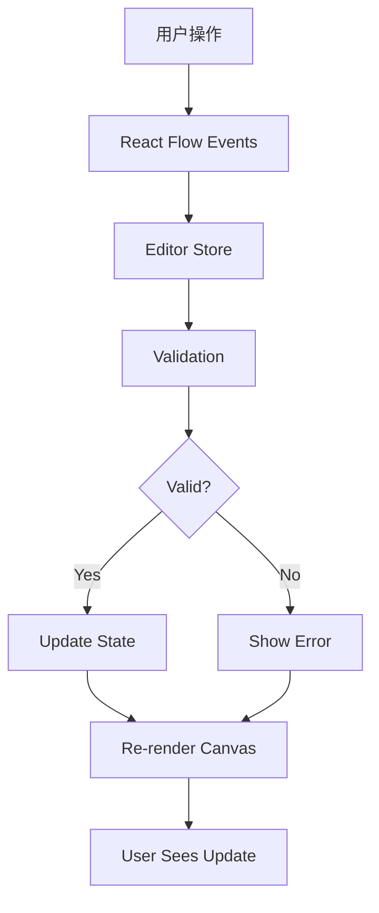

# Teable 自动化可视化编辑器详细设计

> **文档版本**: v1.0  
> **创建日期**: 2026-02-05  
> **技术栈**: React + React Flow + TypeScript

---

## 📋 目录

1. [概述](#1-概述)
2. [技术选型](#2-技术选型)
3. [组件架构](#3-组件架构)
4. [节点设计](#4-节点设计)
5. [交互逻辑](#5-交互逻辑)
6. [状态管理](#6-状态管理)
7. [样式设计](#7-样式设计)
8. [实现示例](#8-实现示例)

---

## 1. 概述

### 1.1 设计目标

创建一个直观、易用的可视化工作流编辑器,让用户能够:
- 通过拖拽方式构建自动化工作流
- 可视化查看工作流的执行逻辑
- 快速配置触发器、条件和动作
- 实时预览工作流效果

### 1.2 核心特性

- ✅ **拖拽式编辑**: 通过拖拽添加和连接节点
- ✅ **实时验证**: 配置错误实时提示
- ✅ **智能连接**: 自动验证节点连接的合法性
- ✅ **配置面板**: 侧边栏配置节点详细参数
- ✅ **撤销/重做**: 支持操作历史管理
- ✅ **导入/导出**: 支持工作流的导入导出

---

## 2. 技术选型

### 2.1 React Flow

**选择理由**:
- ✅ 成熟的流程图库,社区活跃
- ✅ 支持自定义节点和边
- ✅ 内置缩放、平移、选择等功能
- ✅ TypeScript 支持良好
- ✅ 性能优秀,支持大规模节点

**替代方案**: Xyflow (React Flow 的新版本)

### 2.2 状态管理

使用 **Zustand** 或 **React Context + useReducer**

**选择理由**:
- 轻量级
- TypeScript 支持好
- 与 React Flow 集成简单

### 2.3 表单验证

使用 **React Hook Form + Zod**

**选择理由**:
- 性能好
- 类型安全
- 与现有技术栈一致

---

## 3. 组件架构

### 3.1 整体结构

```
WorkflowEditor/
├── index.tsx                    # 主入口
├── components/
│   ├── Canvas/                  # 画布组件
│   │   ├── index.tsx
│   │   ├── CustomNodes/         # 自定义节点
│   │   │   ├── TriggerNode.tsx
│   │   │   ├── ConditionNode.tsx
│   │   │   └── ActionNode.tsx
│   │   ├── CustomEdges/         # 自定义连线
│   │   │   └── CustomEdge.tsx
│   │   └── Controls/            # 控制按钮
│   │       └── CanvasControls.tsx
│   ├── Sidebar/                 # 侧边栏
│   │   ├── index.tsx
│   │   ├── NodePalette.tsx      # 节点面板
│   │   └── ConfigPanel.tsx      # 配置面板
│   ├── ConfigForms/             # 配置表单
│   │   ├── TriggerConfigForm.tsx
│   │   ├── ConditionConfigForm.tsx
│   │   └── ActionConfigForm.tsx
│   └── Toolbar/                 # 工具栏
│       └── index.tsx
├── hooks/
│   ├── useWorkflowEditor.ts     # 编辑器逻辑
│   ├── useNodeOperations.ts     # 节点操作
│   └── useValidation.ts         # 验证逻辑
├── store/
│   └── editorStore.ts           # 状态管理
├── types/
│   └── index.ts                 # 类型定义
└── utils/
    ├── nodeFactory.ts           # 节点工厂
    ├── validation.ts            # 验证工具
    └── serialization.ts         # 序列化工具
```

### 3.2 数据流



---

## 4. 节点设计

### 4.1 节点类型

#### 4.1.1 触发器节点 (TriggerNode)

**特点**:
- 工作流的起点,只能有一个
- 无输入句柄,只有输出句柄
- 显示触发器类型和关键配置

**数据结构**:
```typescript
interface TriggerNodeData {
  type: 'trigger';
  triggerType: TriggerType;
  config: TriggerConfig;
  label: string;
  isValid: boolean;
  errors?: string[];
}
```

**UI 设计**:
```
┌─────────────────────────────┐
│ 🎯 触发器                    │
├─────────────────────────────┤
│ 当记录更新时                 │
│ 表: 任务表                   │
│ 字段: 状态                   │
└─────────────────────────────┘
                ↓ (输出句柄)
```

#### 4.1.2 条件节点 (ConditionNode)

**特点**:
- 可选节点,用于逻辑判断
- 有输入和输出句柄
- 支持多条件组合

**数据结构**:
```typescript
interface ConditionNodeData {
  type: 'condition';
  conditions: Condition[];
  logicOperator: 'AND' | 'OR';
  label: string;
  isValid: boolean;
  errors?: string[];
}
```

**UI 设计**:
```
        ↓ (输入句柄)
┌─────────────────────────────┐
│ ❓ 条件判断                  │
├─────────────────────────────┤
│ 如果:                        │
│ • 优先级 = 高                │
│ AND                          │
│ • 负责人 不为空              │
└─────────────────────────────┘
                ↓ (输出句柄)
```

#### 4.1.3 动作节点 (ActionNode)

**特点**:
- 执行具体操作
- 有输入句柄,可有输出句柄(用于链接下一个动作)
- 显示动作类型和关键参数

**数据结构**:
```typescript
interface ActionNodeData {
  type: 'action';
  actionType: ActionType;
  config: ActionConfig;
  order: number;
  label: string;
  isValid: boolean;
  errors?: string[];
}
```

**UI 设计**:
```
        ↓ (输入句柄)
┌─────────────────────────────┐
│ ⚡ 动作                      │
├─────────────────────────────┤
│ 发送通知                     │
│ 收件人: {{负责人}}           │
│ 标题: 新任务分配             │
└─────────────────────────────┘
                ↓ (输出句柄,可选)
```

### 4.2 节点状态

每个节点可以有以下状态:
- **正常**: 配置完整且有效
- **未配置**: 新创建,未配置
- **错误**: 配置无效
- **执行中**: 测试执行时
- **成功**: 测试成功
- **失败**: 测试失败

**状态颜色**:
```typescript
const nodeStatusColors = {
  normal: '#10b981',      // 绿色
  unconfigured: '#94a3b8', // 灰色
  error: '#ef4444',       // 红色
  running: '#3b82f6',     // 蓝色
  success: '#22c55e',     // 亮绿
  failed: '#dc2626',      // 深红
};
```

---

## 5. 交互逻辑

### 5.1 添加节点

**方式 1: 从节点面板拖拽**
```typescript
const onDragStart = (event: DragEvent, nodeType: NodeType) => {
  event.dataTransfer.setData('application/reactflow', nodeType);
  event.dataTransfer.effectAllowed = 'move';
};

const onDrop = (event: DragEvent) => {
  event.preventDefault();
  const nodeType = event.dataTransfer.getData('application/reactflow');
  const position = screenToFlowPosition({
    x: event.clientX,
    y: event.clientY,
  });
  
  addNode(nodeType, position);
};
```

**方式 2: 点击添加按钮**
```typescript
const addNode = (nodeType: NodeType, position?: XYPosition) => {
  const newNode = createNode(nodeType, position);
  setNodes((nds) => [...nds, newNode]);
  
  // 自动打开配置面板
  setSelectedNode(newNode.id);
};
```

### 5.2 连接节点

**验证规则**:
```typescript
const isValidConnection = (connection: Connection): boolean => {
  const { source, target } = connection;
  
  // 规则 1: 不能连接到自己
  if (source === target) return false;
  
  // 规则 2: 触发器只能作为起点
  const sourceNode = getNode(source);
  if (sourceNode?.type === 'trigger' && connection.sourceHandle !== 'output') {
    return false;
  }
  
  // 规则 3: 不能形成循环
  if (wouldCreateCycle(source, target)) return false;
  
  // 规则 4: 触发器只能有一个
  if (sourceNode?.type === 'trigger' && hasMultipleTriggers()) {
    return false;
  }
  
  return true;
};
```

### 5.3 删除节点

```typescript
const deleteNode = (nodeId: string) => {
  // 删除节点
  setNodes((nds) => nds.filter((n) => n.id !== nodeId));
  
  // 删除相关连线
  setEdges((eds) => eds.filter((e) => 
    e.source !== nodeId && e.target !== nodeId
  ));
  
  // 关闭配置面板
  if (selectedNode === nodeId) {
    setSelectedNode(null);
  }
};
```

### 5.4 配置节点

```typescript
const updateNodeConfig = (nodeId: string, config: any) => {
  setNodes((nds) =>
    nds.map((node) => {
      if (node.id === nodeId) {
        return {
          ...node,
          data: {
            ...node.data,
            config,
            isValid: validateConfig(node.type, config),
          },
        };
      }
      return node;
    })
  );
};
```

---

## 6. 状态管理

### 6.1 Editor Store

使用 Zustand 管理编辑器状态:

```typescript
import create from 'zustand';
import { Node, Edge, Connection } from 'reactflow';

interface EditorState {
  // 节点和边
  nodes: Node[];
  edges: Edge[];
  
  // 选中状态
  selectedNode: string | null;
  selectedEdge: string | null;
  
  // 工作流信息
  workflow: Workflow | null;
  
  // UI 状态
  isSidebarOpen: boolean;
  isConfigPanelOpen: boolean;
  
  // 操作历史
  history: {
    past: Array<{ nodes: Node[]; edges: Edge[] }>;
    future: Array<{ nodes: Node[]; edges: Edge[] }>;
  };
  
  // Actions
  setNodes: (nodes: Node[] | ((nodes: Node[]) => Node[])) => void;
  setEdges: (edges: Edge[] | ((edges: Edge[]) => Edge[])) => void;
  addNode: (nodeType: NodeType, position?: XYPosition) => void;
  deleteNode: (nodeId: string) => void;
  updateNodeData: (nodeId: string, data: any) => void;
  selectNode: (nodeId: string | null) => void;
  undo: () => void;
  redo: () => void;
  saveWorkflow: () => Promise<void>;
  loadWorkflow: (workflowId: string) => Promise<void>;
}

export const useEditorStore = create<EditorState>((set, get) => ({
  nodes: [],
  edges: [],
  selectedNode: null,
  selectedEdge: null,
  workflow: null,
  isSidebarOpen: true,
  isConfigPanelOpen: false,
  history: { past: [], future: [] },
  
  setNodes: (nodes) => {
    set((state) => ({
      nodes: typeof nodes === 'function' ? nodes(state.nodes) : nodes,
    }));
  },
  
  setEdges: (edges) => {
    set((state) => ({
      edges: typeof edges === 'function' ? edges(state.edges) : edges,
    }));
  },
  
  addNode: (nodeType, position) => {
    const newNode = createNode(nodeType, position);
    set((state) => ({
      nodes: [...state.nodes, newNode],
      selectedNode: newNode.id,
      isConfigPanelOpen: true,
    }));
  },
  
  deleteNode: (nodeId) => {
    set((state) => ({
      nodes: state.nodes.filter((n) => n.id !== nodeId),
      edges: state.edges.filter((e) => 
        e.source !== nodeId && e.target !== nodeId
      ),
      selectedNode: state.selectedNode === nodeId ? null : state.selectedNode,
    }));
  },
  
  updateNodeData: (nodeId, data) => {
    set((state) => ({
      nodes: state.nodes.map((node) =>
        node.id === nodeId
          ? { ...node, data: { ...node.data, ...data } }
          : node
      ),
    }));
  },
  
  selectNode: (nodeId) => {
    set({ selectedNode: nodeId, isConfigPanelOpen: !!nodeId });
  },
  
  undo: () => {
    const { history, nodes, edges } = get();
    if (history.past.length === 0) return;
    
    const previous = history.past[history.past.length - 1];
    const newPast = history.past.slice(0, -1);
    
    set({
      nodes: previous.nodes,
      edges: previous.edges,
      history: {
        past: newPast,
        future: [{ nodes, edges }, ...history.future],
      },
    });
  },
  
  redo: () => {
    const { history, nodes, edges } = get();
    if (history.future.length === 0) return;
    
    const next = history.future[0];
    const newFuture = history.future.slice(1);
    
    set({
      nodes: next.nodes,
      edges: next.edges,
      history: {
        past: [...history.past, { nodes, edges }],
        future: newFuture,
      },
    });
  },
  
  saveWorkflow: async () => {
    const { nodes, edges, workflow } = get();
    const workflowData = serializeWorkflow(nodes, edges);
    
    if (workflow?.id) {
      await updateWorkflow(workflow.id, workflowData);
    } else {
      const newWorkflow = await createWorkflow(workflowData);
      set({ workflow: newWorkflow });
    }
  },
  
  loadWorkflow: async (workflowId) => {
    const workflow = await getWorkflow(workflowId);
    const { nodes, edges } = deserializeWorkflow(workflow);
    
    set({
      workflow,
      nodes,
      edges,
      selectedNode: null,
      isConfigPanelOpen: false,
    });
  },
}));
```

---

## 7. 样式设计

### 7.1 节点样式

```css
/* 基础节点样式 */
.custom-node {
  min-width: 280px;
  background: white;
  border: 2px solid #e2e8f0;
  border-radius: 12px;
  box-shadow: 0 4px 6px -1px rgba(0, 0, 0, 0.1);
  transition: all 0.2s ease;
}

.custom-node:hover {
  box-shadow: 0 10px 15px -3px rgba(0, 0, 0, 0.1);
  transform: translateY(-2px);
}

.custom-node.selected {
  border-color: #3b82f6;
  box-shadow: 0 0 0 3px rgba(59, 130, 246, 0.1);
}

/* 节点头部 */
.node-header {
  display: flex;
  align-items: center;
  gap: 8px;
  padding: 12px 16px;
  background: linear-gradient(135deg, #f8fafc 0%, #f1f5f9 100%);
  border-bottom: 1px solid #e2e8f0;
  border-radius: 10px 10px 0 0;
}

.node-icon {
  font-size: 20px;
}

.node-title {
  font-weight: 600;
  font-size: 14px;
  color: #1e293b;
}

/* 节点内容 */
.node-content {
  padding: 12px 16px;
}

.node-label {
  font-size: 13px;
  color: #475569;
  margin-bottom: 8px;
}

.node-config-item {
  display: flex;
  align-items: center;
  gap: 6px;
  font-size: 12px;
  color: #64748b;
  margin-bottom: 4px;
}

/* 节点状态 */
.node-status {
  position: absolute;
  top: 8px;
  right: 8px;
  width: 8px;
  height: 8px;
  border-radius: 50%;
}

.node-status.valid {
  background: #10b981;
}

.node-status.invalid {
  background: #ef4444;
}

.node-status.unconfigured {
  background: #94a3b8;
}

/* 句柄样式 */
.custom-handle {
  width: 12px;
  height: 12px;
  background: white;
  border: 2px solid #3b82f6;
  border-radius: 50%;
}

.custom-handle:hover {
  width: 16px;
  height: 16px;
  border-width: 3px;
}
```

### 7.2 连线样式

```css
/* 自定义边 */
.custom-edge {
  stroke: #94a3b8;
  stroke-width: 2;
}

.custom-edge.selected {
  stroke: #3b82f6;
  stroke-width: 3;
}

.custom-edge.animated {
  stroke-dasharray: 5;
  animation: dashdraw 0.5s linear infinite;
}

@keyframes dashdraw {
  to {
    stroke-dashoffset: -10;
  }
}

/* 边标签 */
.edge-label {
  background: white;
  padding: 4px 8px;
  border-radius: 4px;
  font-size: 11px;
  color: #64748b;
  border: 1px solid #e2e8f0;
}
```

---

## 8. 实现示例

### 8.1 主编辑器组件

```tsx
import React from 'react';
import ReactFlow, {
  Background,
  Controls,
  MiniMap,
  useNodesState,
  useEdgesState,
  addEdge,
  Connection,
  Edge,
} from 'reactflow';
import 'reactflow/dist/style.css';

import TriggerNode from './components/CustomNodes/TriggerNode';
import ConditionNode from './components/CustomNodes/ConditionNode';
import ActionNode from './components/CustomNodes/ActionNode';
import Sidebar from './components/Sidebar';
import ConfigPanel from './components/ConfigPanel';
import Toolbar from './components/Toolbar';

const nodeTypes = {
  trigger: TriggerNode,
  condition: ConditionNode,
  action: ActionNode,
};

export default function WorkflowEditor() {
  const [nodes, setNodes, onNodesChange] = useNodesState([]);
  const [edges, setEdges, onEdgesChange] = useEdgesState([]);
  const [selectedNode, setSelectedNode] = React.useState<string | null>(null);

  const onConnect = React.useCallback(
    (params: Connection) => {
      if (isValidConnection(params)) {
        setEdges((eds) => addEdge(params, eds));
      }
    },
    []
  );

  const onNodeClick = React.useCallback(
    (event: React.MouseEvent, node: Node) => {
      setSelectedNode(node.id);
    },
    []
  );

  const onPaneClick = React.useCallback(() => {
    setSelectedNode(null);
  }, []);

  return (
    <div className="workflow-editor">
      <Toolbar />
      
      <div className="editor-content">
        <Sidebar />
        
        <div className="canvas-container">
          <ReactFlow
            nodes={nodes}
            edges={edges}
            onNodesChange={onNodesChange}
            onEdgesChange={onEdgesChange}
            onConnect={onConnect}
            onNodeClick={onNodeClick}
            onPaneClick={onPaneClick}
            nodeTypes={nodeTypes}
            fitView
          >
            <Background />
            <Controls />
            <MiniMap />
          </ReactFlow>
        </div>
        
        {selectedNode && (
          <ConfigPanel
            nodeId={selectedNode}
            onClose={() => setSelectedNode(null)}
          />
        )}
      </div>
    </div>
  );
}
```

### 8.2 触发器节点组件

```tsx
import React from 'react';
import { Handle, Position, NodeProps } from 'reactflow';
import { TriggerNodeData } from '../../types';

export default function TriggerNode({ data, selected }: NodeProps<TriggerNodeData>) {
  const getTriggerIcon = (type: string) => {
    const icons: Record<string, string> = {
      record_created: '➕',
      record_updated: '✏️',
      field_changed: '🔄',
      schedule: '⏰',
    };
    return icons[type] || '🎯';
  };

  return (
    <div className={`custom-node trigger-node ${selected ? 'selected' : ''}`}>
      {/* 状态指示器 */}
      <div className={`node-status ${data.isValid ? 'valid' : 'invalid'}`} />
      
      {/* 节点头部 */}
      <div className="node-header">
        <span className="node-icon">{getTriggerIcon(data.triggerType)}</span>
        <span className="node-title">触发器</span>
      </div>
      
      {/* 节点内容 */}
      <div className="node-content">
        <div className="node-label">{data.label}</div>
        
        {data.config && (
          <div className="node-config">
            {data.config.tableId && (
              <div className="node-config-item">
                📊 表: {data.config.tableName}
              </div>
            )}
            {data.config.fieldId && (
              <div className="node-config-item">
                🏷️ 字段: {data.config.fieldName}
              </div>
            )}
          </div>
        )}
        
        {data.errors && data.errors.length > 0 && (
          <div className="node-errors">
            {data.errors.map((error, index) => (
              <div key={index} className="error-message">
                ⚠️ {error}
              </div>
            ))}
          </div>
        )}
      </div>
      
      {/* 输出句柄 */}
      <Handle
        type="source"
        position={Position.Bottom}
        id="output"
        className="custom-handle"
      />
    </div>
  );
}
```

### 8.3 配置面板组件

```tsx
import React from 'react';
import { useForm } from 'react-hook-form';
import { zodResolver } from '@hookform/resolvers/zod';
import { z } from 'zod';
import { useEditorStore } from '../../store/editorStore';

interface ConfigPanelProps {
  nodeId: string;
  onClose: () => void;
}

export default function ConfigPanel({ nodeId, onClose }: ConfigPanelProps) {
  const { nodes, updateNodeData } = useEditorStore();
  const node = nodes.find((n) => n.id === nodeId);

  if (!node) return null;

  const renderConfigForm = () => {
    switch (node.type) {
      case 'trigger':
        return <TriggerConfigForm node={node} />;
      case 'condition':
        return <ConditionConfigForm node={node} />;
      case 'action':
        return <ActionConfigForm node={node} />;
      default:
        return null;
    }
  };

  return (
    <div className="config-panel">
      <div className="config-panel-header">
        <h3>配置节点</h3>
        <button onClick={onClose}>✕</button>
      </div>
      
      <div className="config-panel-content">
        {renderConfigForm()}
      </div>
    </div>
  );
}

// 触发器配置表单
function TriggerConfigForm({ node }: { node: Node<TriggerNodeData> }) {
  const { updateNodeData } = useEditorStore();
  
  const schema = z.object({
    triggerType: z.enum(['record_created', 'record_updated', 'field_changed', 'schedule']),
    tableId: z.string().min(1, '请选择表'),
    fieldId: z.string().optional(),
  });

  const { register, handleSubmit, watch, formState: { errors } } = useForm({
    resolver: zodResolver(schema),
    defaultValues: node.data.config,
  });

  const triggerType = watch('triggerType');

  const onSubmit = (data: any) => {
    updateNodeData(node.id, {
      config: data,
      isValid: true,
      label: generateTriggerLabel(data),
    });
  };

  return (
    <form onSubmit={handleSubmit(onSubmit)} className="config-form">
      <div className="form-group">
        <label>触发器类型</label>
        <select {...register('triggerType')}>
          <option value="record_created">记录创建时</option>
          <option value="record_updated">记录更新时</option>
          <option value="field_changed">字段变更时</option>
          <option value="schedule">定时触发</option>
        </select>
        {errors.triggerType && (
          <span className="error">{errors.triggerType.message}</span>
        )}
      </div>

      <div className="form-group">
        <label>选择表</label>
        <select {...register('tableId')}>
          <option value="">请选择</option>
          {/* 从 API 获取表列表 */}
        </select>
        {errors.tableId && (
          <span className="error">{errors.tableId.message}</span>
        )}
      </div>

      {triggerType === 'field_changed' && (
        <div className="form-group">
          <label>监听字段</label>
          <select {...register('fieldId')}>
            <option value="">请选择</option>
            {/* 从 API 获取字段列表 */}
          </select>
        </div>
      )}

      <button type="submit" className="btn-primary">
        保存配置
      </button>
    </form>
  );
}
```

---

## 总结

本文档详细设计了 Teable 自动化可视化编辑器的实现方案,包括:

1. ✅ **技术选型**: React Flow 作为核心库
2. ✅ **组件架构**: 清晰的组件层次和职责划分
3. ✅ **节点设计**: 三种核心节点类型及其交互
4. ✅ **状态管理**: 使用 Zustand 管理编辑器状态
5. ✅ **样式设计**: 现代化的 UI 设计规范
6. ✅ **实现示例**: 完整的代码示例

下一步可以基于此设计开始实现开发工作。

---

**文档结束**
